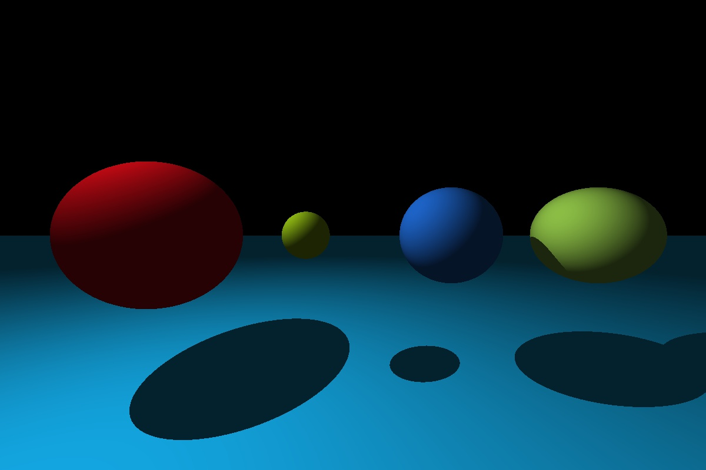

# Simple Ray Tracer

A simple ray tracer written in C++.  

The scene contains four spheres, a plane, and a directional light source.  Objects do not have material properties, but the code base was written in such a way that it can be easily built upon.  There should just be one dependancy needed to build the project and that is `opencv2`.  

If everything works correctly the output should look like the image below.

